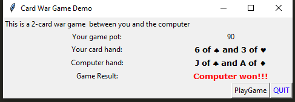

section4.py is the final project. section3.py and codingEx.py are just the steps I took to get to section4.py

The GUI is nothing fancy, it's just a simple game to play against the computer:)

    

    

    

    

    

